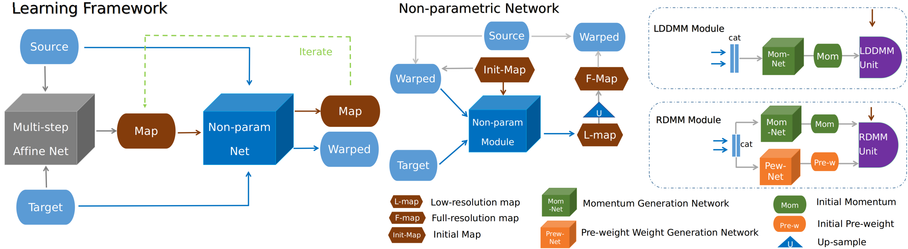
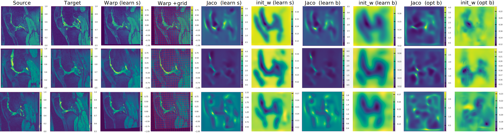
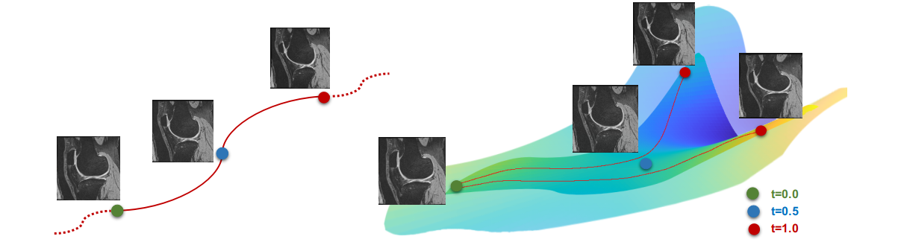
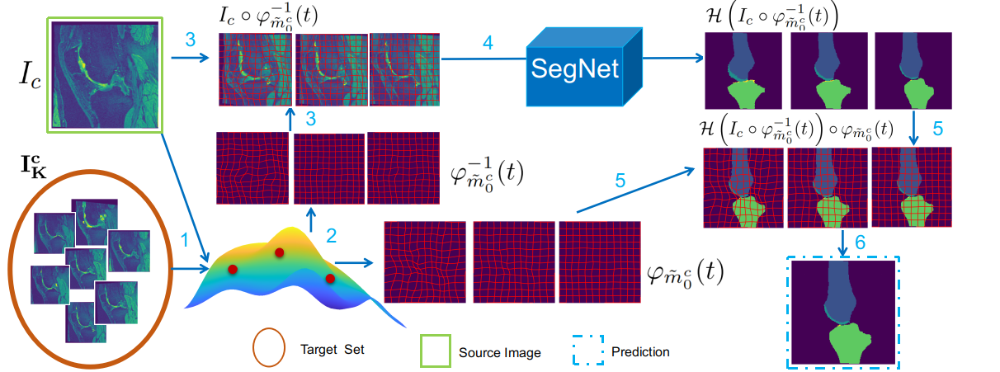

# EasyReg

A friendly tutorial on fluid based registration and augmentation will come soon :)

The EasyReg is a image processing package, that supports a series of mainstream methods.\
We list a few properties:
1) A simple interface for learning/optimization based image registration tools, e.g., [Mermaid](https://github.com/uncbiag/mermaid) and other popular registration
packages<sup>*</sup>.
2) A simple interface for a series of data augmentation approaches, supporting both random data augmentation and anatomical data augmentation/inter-and extra-polation
3) A simple interface for image segmentation.


\*The currently supported methods include Mermaid-optimization (i.e., optimization-based fluid registration) and Mermaid-network (i.e., deep network-based fluid registration methods using the mermaid deformation models).
We also added support for [ANTsPy](https://github.com/ANTsX/ANTsPy), [NiftyReg](http://cmictig.cs.ucl.ac.uk/wiki/index.php/NiftyReg), Demons(embedded in [SimpleITK](http://www.simpleitk.org/SimpleITK/resources/software.html)),
 [VoxelMorph](https://arxiv.org/abs/1809.05231) and its diffeomorphic [variant](https://arxiv.org/abs/1805.04605),  though we recommend using the official release.

Currently, we support 3d image registration (2d is in progress).

<br/>

## Build Documentation
The latest doc can be found here [https://easyreg-unc-biag.readthedocs.io/en/latest/](https://easyreg-unc-biag.readthedocs.io/en/latest/).

Source code documentation and tutorials can be built on local using sphinx.

```
cd EASYREG_REPOSITORY_PATH
cd doc
make html
```
Now you are ready to explore various optimization-based as well as learning-based demos provided by EasyReg.

<br/><br/>

<br/>

## Registration 
We provide a series of demos for both learning and optimization methods :)<br/>
Demo list (for more details, please refer to the [doc](https://easyreg-unc-biag.readthedocs.io/en/latest/notes/walk_through_demos.html)<sup>*</sup>)
1) ANTsPy on OAI (knee MRI of the Osteoarthritis Initiative dataset)
2) NiftyReg on OAI
3) Demons on OAI
4) Optimization-based mermaid registration on OAI ([vSVF](https://arxiv.org/pdf/1903.08811.pdf))
5) Optimization-based mermaid registration on lung pairs<sup>**</sup> (inspiration to expiration) ([RDMM](https://arxiv.org/pdf/1906.00139.pdf))
6) Pretrained learning-based mermaid registration on OAI (vSVF, RDMM)
7) A training demo for joint affine and vSVF registration on sub-OAI dataset (3 pairs)
8) A training demo for VoxelMorph like registration framework (cvpr and miccai version)

\* For 2D demo (vSVF, LDDMM, RDMM) on synthetic data, please refers to [mermaid](https://mermaid.readthedocs.io/en/latest/notes/rdmm_example.html)<br/>
** Thanks Dr. Raúl San José Estépar for providing the lung data
<br/>
<br/><br/>


For the learning part, the easyreg provides a two-stage learning framework including affine registration and non-parametric registration (map-based). 


An illustration of learning architecture 

<br>


Registration results from Region-spec Region-specific Diffeomorphic Metric Mapping (RDMM)

<br>

<br/><br/>


<br/>

## Data Augmentation/Interpolation

We provide an easy interface for fluid-based data augmentation and interpolation/extrapolation.
A typical strategy is as following:
1) Construct a geodesic subspace with given a source image and a set of target images.
2) Sample transformations from the resulting geodesic subspace.
3) Obtain deformed images and segmentations via interpolation.

The current supported method list:
1) Anatomical fluid-based data augmentation
2) Random data augmentation (including Bspline random transformation and Random momentum based fluid data augmentation)
3) [Brainstorm](https://arxiv.org/abs/1902.09383) like data-augmentation framework

Related demos can be found at [Demos on Data augmentation](https://easyreg-unc-biag.readthedocs.io/en/latest/notes/walk_through_demos.html#demos-on-data-augmentation) section.


An illustration of sampling from geodesic subspace.

<br>

<br/><br/>


<br/>

## Segmentation
We provide an interface for image segmentaion task with a u-net structure.
The segmentation framework supports an *test* phase *data augmentation* method that can generally improve the performance without additional models.

An illustration of data augmentation- based ensemble prediction during test.

<br>

<br/><br/>

# Installation
```
conda create -n easyreg python=3.6
conda activate easyreg
git clone https://github.com/uncbiag/easyreg.git
cd easyreg
git clone https://github.com/uncbiag/mermaid.git
pip install -r requirements.txt

# ################download demo (optional)######
cd demo
gdown https://drive.google.com/uc?id=1m0dhCUYe3DTisHEV3FMy7LY0SIJlTjpa
unzip demo.zip -d . 
cd ..
# #############################################

cd mermaid
python setup.py develop
```
For third-party toolkits:

**ANTsPy**

We currently test using ANTsPy version 0.1.4. Since AntsPy is not fully functioned,
 it will be replaced with a custom Ants Package in the next release. The following command installs ANTsPy 0.1.4.
 
 ```

pip install  https://github.com/ANTsX/ANTsPy/releases/download/v0.1.4/antspy-0.1.4-cp36-cp36m-linux_x86_64.whl
```

**NiftyReg**

For NiftyReg installation instructions please refer to [NiftyReg Installation](http://cmictig.cs.ucl.ac.uk/wiki/index.php/NiftyReg_install)
<br/><br/>


# Related papers

If you find EasyReg is helpful, please cite (see [bibtex](citations.bib)):

Anatomical Data Augmentation via Fluid-based Image Registration [[link]](https://arxiv.org/pdf/2007.02447.pdf)\
Zhengyang Shen, Zhenlin Xu, Sahin Olut, Marc Niethammer. MICCAI 2020.

Region-specific Diffeomorphic Metric Mapping [[link]](https://arxiv.org/pdf/1906.00139.pdf)\
Zhengyang Shen, François-Xavier Vialard, Marc Niethammer. NeurIPS 2019.

Networks for Joint Affine and Non-parametric Image Registration [[link]](https://arxiv.org/pdf/1903.08811.pdf)\
Zhengyang Shen, Xu Han, Zhenlin Xu, Marc Niethammer. CVPR 2019.


# Our other registration work

See https://github.com/uncbiag/registration for an overview of other registration approaches of our group and a short summary of how the approaches relate.


    
